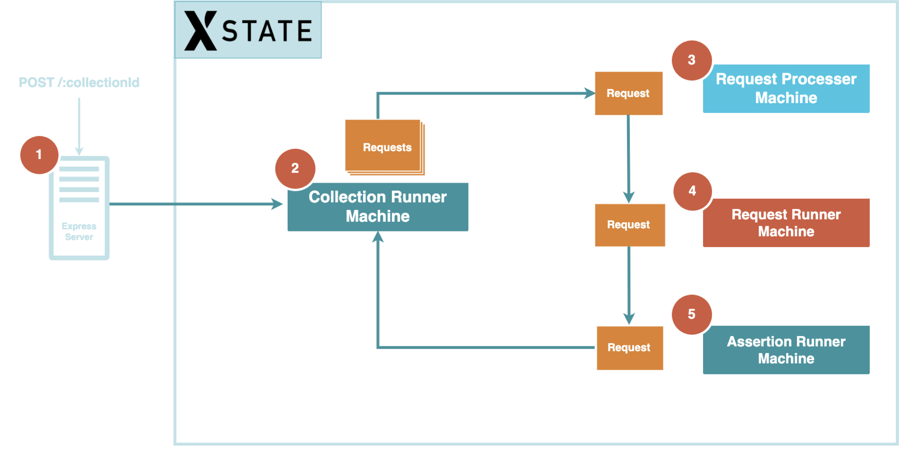

# Collection Runner for Skopos
The collection runner is a component of Skopos that is responsible for executing multi-step tests. It uses Xstate as a state machine to orchestrate multi-step testing. The collection runner:
- Fetches data necessary for running the tests from a graphql server.
- Executes the tests using a state machine (Xstate).
- If any error occurs, it sends a notification using SNS (Simple Notification Service).
- Finally, it sends the tests data to the graphql server.

|:--:|
|<b>Diagram illustrating how the collection runner executes a collection of tests.</b>|
(1) Receives a POST request with ‘collectionId' as a parameter. (2) Invokes the main collection runner state machine. (3-5) To execute each test, the main state machine invokes a sequence of child state machines.|

# Requirement

For development you will need Node.js environment and a running [graphql server](https://github.com/skopos-api-monitoring/skopos-backend).

# Getting Started

1. Clone the repo: `git clone https://github.com/skopos-api-monitoring/skopos-collection-runner.git`
2. Navigate inside the folder: `cd skopos-collection-runner`
3. Run NPM install to generate necessary type files: `npm install`
4. Add an `.env` file with the following variables in the root folder:
  - `GRAPHQL_URL`
  - `AWS_REGION`
5. Run the app: `npm start`
